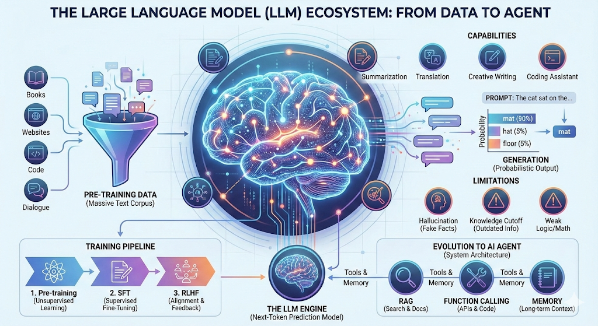

## 先祛个魅：它到底是什么
23 年刚开始用 ChatGPT 的时候，一直把它当成「什么都知道的百科全书」。后来才发现这个理解完全跑偏了。

说白了，**LLM 就是一个超级自动补全工具**——一个玩「文字接龙」玩到极致的系统。

### 训练阶段

模型在发布前「读」了海量的书籍、网页、代码和对话。但它不是像人一样理解内容（它不知道「悲伤」是什么感受），而是像个统计学家在疯狂算概率：

- 「床前明月」后面，99% 是「光」
- 「Python」后面，大概率跟代码相关

所以它学到的是**词与词之间的概率关系**，不是存了一堆「死知识」在数据库里。

### 生成阶段

输入 Prompt 后，它做的事情很简单：根据上文预测下一个最可能出现的字，然后一个字一个字地「吐」出来。

因为读的书够多、规律掌握得够深，生成的文字不仅通顺，看起来还挺有逻辑，仿佛真的「懂」了。

> **关键认知：它是概率引擎，不是真理数据库。** 核心目标是让句子通顺、像人话，而不是保证内容正确。

想通这一点，后面很多「奇怪行为」就都能解释了。

---

## Tokenization：机器眼中的文字

LLM 不认识汉字，也不认识英文单词——它只认数字。所有文字进入模型前，都要先切成 Token：

```
"Hello world" → ["Hello", " world"] → [15496, 995]
"你好世界"    → ["你好", "世界"]     → [57668, 99489]
```

一个 Token 可能是完整的词、词的一部分，甚至单个字符。

这里有个 trade-off：
- 词表太大 → 模型参数膨胀，训练成本高
- 词表太小 → 序列变长，上下文窗口利用率低

目前主流方案是 **BPE（Byte-Pair Encoding）**，从字符级别开始，逐步合并高频字符对。好处是遇到生词也能拆成已知子词处理，不会直接懵掉。

> 📌 分词器的细节会写一篇，对比下 word-level、char-level 和 subword-level 各自的优劣。

---

## Transformer：让大规模训练成为可能

如果说 Token 是砖块，Transformer 就是蓝图，**Attention（注意力机制）** 是粘合剂。

### 为什么 Transformer 这么重要

它彻底告别了 RNN 的串行时代。以前一个词一个词地算，慢得要死；现在可以并行处理，千亿参数的模型才成为可能。

### Self-Attention 在做什么

这两句话里的「苹果」意思完全不同：

- 「苹果掉了，因为它坏了」→ 水果
- 「苹果跌了，因为市场不好」→ 公司

模型怎么区分？靠 Self-Attention。每个词都会「看」其他所有词，计算关联强度，然后加权聚合信息。「苹果」会重点关注「坏了」还是「市场」，从而得到不同的语义表示。

### 位置编码

并行计算带来一个问题：模型不知道词的顺序了。解决方案是给每个位置注入独特的「坐标信息」——位置编码。

---

## 训练三部曲：从「会说话」到「会帮忙」

一个好用的 LLM 不是一步到位的，通常经过三个阶段：

### 1. Pre-training（预训练）

目标很简单：**预测下一个 Token**。

让模型读遍互联网，学会语言的统计规律。训练完之后它会说话了，但只会自说自话地续写，像个自嗨的作家。

### 2. SFT（监督微调）

用高质量的问答数据，教它「有问必答」。

这一步之后，它从「续写机器」变成「对话助手」，知道你问什么该答什么。

### 3. RLHF（人类反馈强化学习）

通过奖励模型和 PPO 算法，让回答更符合人类偏好：**有用、诚实、无害**。

这一步决定了模型是「乐于助人的助手」还是「危险的工具」。

> 📌 后训练阶段会继续深挖。

---

## 采样策略：控制「胡说」的程度

模型生成文字时，本质上是在概率分布里做选择。怎么选，直接影响输出风格。

### Temperature（温度）

控制概率分布的「锐利程度」：

- **低温（如 0.1）**：分布更尖锐，倾向选概率最高的词，输出更确定、保守
- **高温（如 1.5）**：分布更平坦，随机性增加，更有创意，但也更容易「胡说」

### Top-k 和 Top-p

通过截断概率尾部来平衡质量和多样性：

- **Top-k**：只从概率最高的 k 个词里选
- **Top-p（Nucleus Sampling）**：只从累积概率达到 p 的词里选

实际用下来，这几个参数组合调一调，效果差别挺大的。

> 📌 写个代码 demo，直观展示不同参数对生成结果的影响。

---

## 能力边界：它不擅长什么

理解了「概率预测机」的本质，这些毛病就都能解释了：

### 幻觉（Hallucination）

问它一个不存在的历史人物，它可能编得有模有样。原因很简单：它追求的是「语言通顺」，不是「事实正确」。概率库里没有确切答案时，它会拼凑出最像答案的文字。

→ 医疗、法律这种严谨场景，不能直接依赖原生 LLM，必须有人工审核或外部知识库兜底。

### 实时性缺失

问它「昨天某公司股价多少」，它答不上来。它的记忆停留在训练结束那天，之后发生的事它不知道。

→ 新闻类问题必须结合搜索插件。

### 数学和逻辑短板

复杂的加减乘除、多步逻辑推理，经常出错。它是靠「语感」预测下一个字，不是真的在做逻辑运算。

→ 精准计算的场景，让 AI 调用代码解释器或计算器，别让它自己「算」。

### 记忆力限制

聊得太久，它会忘记最开始的设定。它的「视线」是有限的（Context Window），超过一定长度，前面的内容就被丢掉了。

---

## Agent：用系统设计弥补模型缺陷

**LLM 的弱点恰好成就了 Agent 的架构设计**。

如果把 LLM 比作大脑，Agent 就是给这个大脑装上：

- **双手（Tools）**：工具调用，让它能联网、查库、跑代码
- **眼睛（RAG/Search）**：检索增强，解决幻觉和时效性问题
- **记事本（Memory）**：长短期记忆，突破上下文窗口限制
- **任务清单（Planning）**：规划能力，分步解决复杂问题

对应关系：

| LLM 的弱点 | Agent 怎么补 |
|-----------|-------------|
| 无法与现实世界交互 | Tools / Function Calling |
| 幻觉、知识过期 | RAG / 外部知识库 |
| 长链路任务不稳定 | Planning / CoT |
| 记忆力差 | Memory 机制 |

> 📌 动手搭一个 Code Review Agent。

---

## 后续计划

这篇算是个总览，后面打算继续整理：

1. **切词的艺术** — BPE 图解与代码实现
2. **掌控随机性** — Temperature、Top-k、Top-p 采样策略详解
3. **后训练炼金术** — SFT 到 RLHF，怎么「驯服」一个大模型
4. **从玩具到工具** — 搭一个 Code Review Agent
5. **补全短板** — RAG vs Long Context，记忆瓶颈怎么解决

