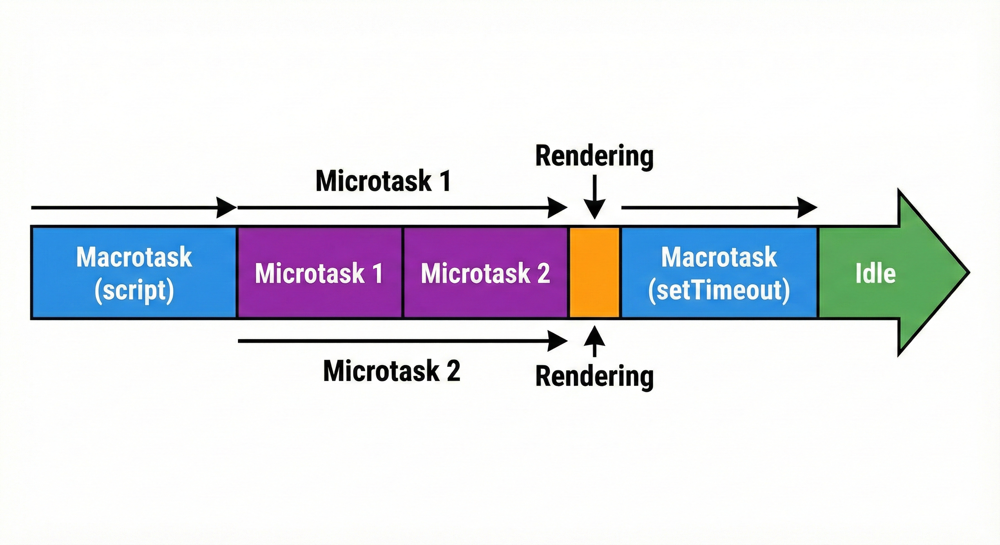
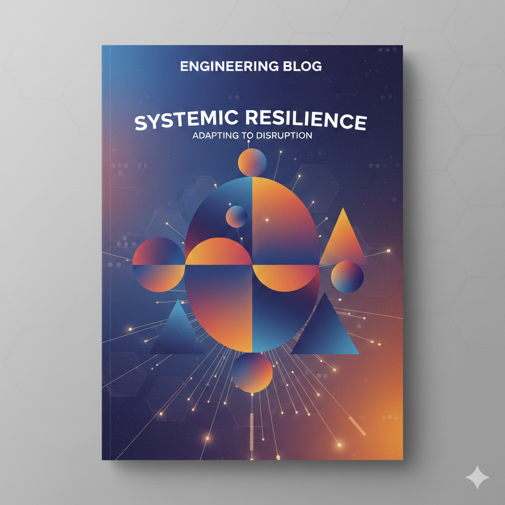

在技术写作中，一张恰当的图片往往能胜过千言万语。优秀的配图不仅能吸引读者，更能帮助他们跨越理解复杂抽象概念的障碍。

本文梳理了技术博客中常用的 **8 种绘图风格**，分析它们的视觉特征和最佳适用场景，供你在创作时参考。

---

## 1. 手绘线稿风 (Hand-Drawn / Whiteboard Sketch)

> **核心关键词**：亲切、草稿、低门槛、头脑风暴

模拟在白板或纸上用马克笔手绘的效果。线条具有自然的抖动感、不完美、擦除痕迹和涂抹感。配色通常以黑白为主，辅以一两种强调色。

*示例：Event Loop 循环的手绘草图*

### 适用场景

- **解释基础概念**：降低初学者对复杂概念的心理防御，如 Event Loop 循环、内存模型草图
- **展示思维过程**：表现一个想法从无到有的头脑风暴过程
- **非正式教程**：需要快速画出流程图或简单调用栈结构的场景

### 为什么有效

给人一种「正在进行中」的亲切感，让读者觉得「我也能理解」。

---

## 2. 扁平极简科技风 (Flat Minimalist Tech)

> **核心关键词**：干净、现代、模块化、对比度

干净、现代、无阴影或渐变的矢量图形风格。使用高对比度的实色块来区分不同的概念区域、容器或模块。强调清晰的边界和标签。

*示例：Docker 容器 vs 虚拟机对比图*

### 适用场景

- **模块对比**：清晰展示不同技术栈、组件或容器的区别，如 Docker 容器 vs 虚拟机
- **展示容器结构**：消息队列、数据缓冲区、不同类型的内存区域
- **标准技术文档**：需要严谨、专业且无视觉干扰的插图

### 为什么有效

信息传达效率高，视觉干扰极少。

---

## 3. 等距立体风 (Isometric / 2.5D Tech)

> **核心关键词**：空间感、并行、层级、物理隐喻

采用 2.5D 视角（通常是 30° 角），营造出工程蓝图感和立体空间感。常用于将抽象概念具象化为物理实体——比如将数据流比喻为传送带、管道。

*示例：Web Worker 与主线程的并行处理*

### 适用场景

- **多线程与并行**：利用空间展示同时发生的动作，如 Web Worker 与主线程、多核 CPU 处理
- **复杂的架构分层**：立体展示系统的上下游关系或网络分层（OSI 模型）
- **具象化隐喻**：将抽象的「任务流」或「数据管道」具象化，增强视觉冲击力

### 为什么有效

视觉吸引力强，能很好地表现「层次」和「流动」。

---

## 4. 时间轴/序列风格 (Timeline & Sequence Style)

> **核心关键词**：顺序、耗时、阻塞、生命周期

结合了扁平风的简洁和时间轴的隐喻。通常是一条明确带有方向的轴线，使用明确的颜色编码（Color Coding）来标示不同类型任务在时间上的先后顺序、持续时间和占用关系。

*示例：异步代码的执行顺序分析*

### 适用场景

- **执行顺序解析**：解释异步操作、Event Loop、Promise 链的执行顺序
- **性能分析**：展示任务耗时，解释什么是「阻塞（Blocking）」和「时间切片（Time Slicing）」
- **生命周期**：展示组件或请求从创建到销毁的全过程，如 React 组件生命周期、HTTP 请求流程

### 为什么有效

最直观地解决「这件事发生在哪一刻」和「为什么会卡顿」的问题。

---

## 5. 标准化架构图风格 (Standardized Architectural Style)

> **核心关键词**：规范、严谨、UML/C4、云基础设施

强调规范性和清晰度，弱化艺术感。通常遵循一定的图示标准（如 UML、C4 Model 或特定云厂商的图标集）。使用标准的几何形状、明确的连线和端口标注来表示系统边界、容器和组件。

*示例：Kubernetes 集群架构图*

### 适用场景

- **宏观系统架构**：展示微服务集群、企业级应用架构图
- **云平台部署图**：展示 AWS/Azure/GCP 的资源拓扑结构（VPC、Load Balancer、EC2、RDS 等）
- **正式技术文档**：需要精确传达组件关系，不容许歧义的场景

### 为什么有效

专业、通用，技术人员之间沟通无障碍。

---

## 6. 节点-链接网络风 (Node-Link Network / Abstract Data Viz)

> **核心关键词**：关系、连接、复杂性、数据结构

弱化「容器」和「边界」的概念，重点突出「点（Nodes）」和「线（Links）」之间的关系。通常使用深色背景，配合发光的线条或粒子效果来表示连接的活跃度或数据的流动，具有很强的科技感和动态感。

*示例：npm 包依赖关系可视化*

### 适用场景

- **数据结构与算法**：展示图（Graph）、树（Tree）、链表，以及算法遍历的过程
- **复杂依赖关系**：展示 npm 包依赖树、数据库 ER 图、知识图谱或神经网络结构
- **追踪系统**：展示分布式系统中的请求链路追踪（Distributed Tracing）

### 为什么有效

极佳地表现复杂网络和多对多关系。

---

## 7. 代码-图解混合风格 (Annotated Code / Hybrid Diagram)

> **核心关键词**：手把手教程、源码分析、直观对应

主体是一个高亮的代码块（Code Block）。使用箭头、方框、气泡文字等视觉元素，直接在代码周围或覆盖在代码上进行标注和解释。图解与代码紧密结合，不可分割。

*示例：JavaScript 闭包原理图解*

### 适用场景

- **深度教程**：解释难以理解的语法特性，如闭包、指针、复杂的 Promise 链
- **算法实现讲解**：逐步演示代码执行时变量和内存的变化
- **源码分析**：分析开源库核心功能的代码逻辑流向

### 为什么有效

读者无需在代码和独立的图表之间来回切换视线，学习效率极高。

---

## 8. 抽象几何/杂志插画风 (Abstract Geometric / Editorial Tech Art)

> **核心关键词**：品牌感、隐喻、氛围、封面图

常见于知名科技公司工程博客的封面。高度抽象，使用基本的几何形状、渐变色、噪点纹理进行组合。它不一定精确解释技术细节，而是传达文章的「主题」和「氛围」，富有设计感。

*示例：「系统韧性」主题的博客封面*

### 适用场景

- **博客封面/Banner**：吸引点击，提升博客的专业度和品牌调性
- **宏大主题引入**：讨论行业趋势、方法论或非常抽象的概念，如「系统的韧性」「AI 的伦理」
- **段落过渡**：作为长文中的视觉休息点

### 为什么有效

提升文章的整体质感和可读性，建立品牌形象。

---

## 风格选择速查表

| 风格 | 核心侧重点 | 最佳用途示例 |
|------|-----------|-------------|
| 1. 手绘线稿风 | 低门槛、草稿感 | Event Loop 初级概念、头脑风暴草图 |
| 2. 扁平极简风 | 清晰、模块对比 | VM vs Container 对比、消息队列结构 |
| 3. 等距立体风 | 空间感、并行层级 | Web Worker 并行处理、OSI 网络分层 |
| 4. 时间轴风格 | 顺序、阻塞、耗时 | 异步代码执行顺序、React 生命周期 |
| 5. 标准架构风 | 规范、严谨、云设施 | K8s 集群架构图、企业级系统设计 |
| 6. 节点网络风 | 关系、连接、复杂网络 | 图算法、依赖关系树、神经网络结构 |
| 7. 代码混合风 | 代码与图示紧密结合 | 闭包原理讲解、复杂算法源码分析 |
| 8. 抽象杂志风 | 设计感、隐喻、氛围 | 博客封面、「未来趋势」类文章插图 |

---

## 实战建议：混合使用

在一篇深度技术博客中，通常不需要拘泥于一种风格。最好的做法是**根据段落的目的混合使用**：

1. 用 **风格 8（杂志风）** 作为文章封面，吸引读者点击
2. 在引言部分，用 **风格 1（手绘风）** 或 **风格 2（扁平风）** 快速介绍核心概念模型
3. 在讲解整体设计时，使用 **风格 5（标准架构风）** 展示系统全貌
4. 在分析核心流程或性能瓶颈时，切换到 **风格 4（时间轴风）**
5. 最后深入代码实现时，使用 **风格 7（代码混合风）** 进行手把手教学

---

## 配图工具推荐

根据不同风格，这里推荐一些常用工具：

| 风格类型     | 推荐工具                          |
| ------------ | --------------------------------- |
| 手绘风       | Excalidraw、tldraw                |
| 扁平/极简风  | Figma、Sketch                     |
| 等距立体风   | Figma + 等距插件、Blender         |
| 时间轴风格   | Mermaid、PlantUML                 |
| 标准架构图   | Draw.io、Lucidchart、C4 Model     |
| 节点网络     | D3.js、Gephi、Obsidian Graph      |
| 代码混合     | Carbon + 图片编辑器、Excalidraw   |
| 抽象杂志风   | Figma、Adobe Illustrator          |

---

## 写在最后

好的配图不是锦上添花，而是技术传播的核心组成部分。希望这份指南能帮助你在下一篇技术博客中，选择最合适的配图风格，让复杂的概念变得清晰易懂。

记住：**最好的配图，是让读者忘记它是一张图，而直接理解了你想表达的概念。**
